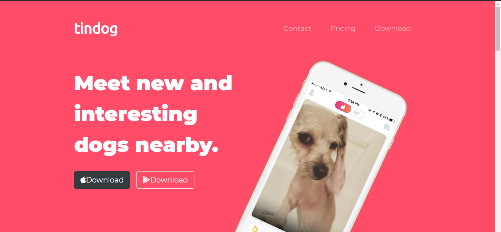
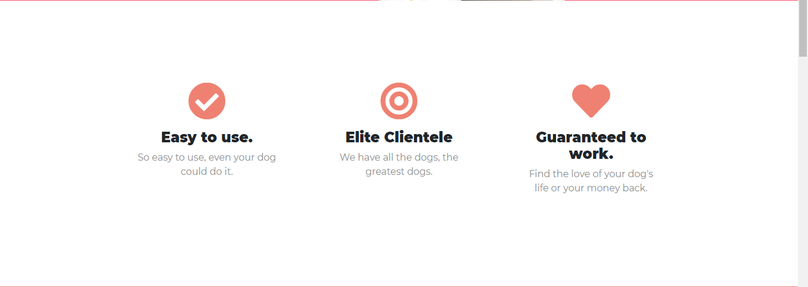
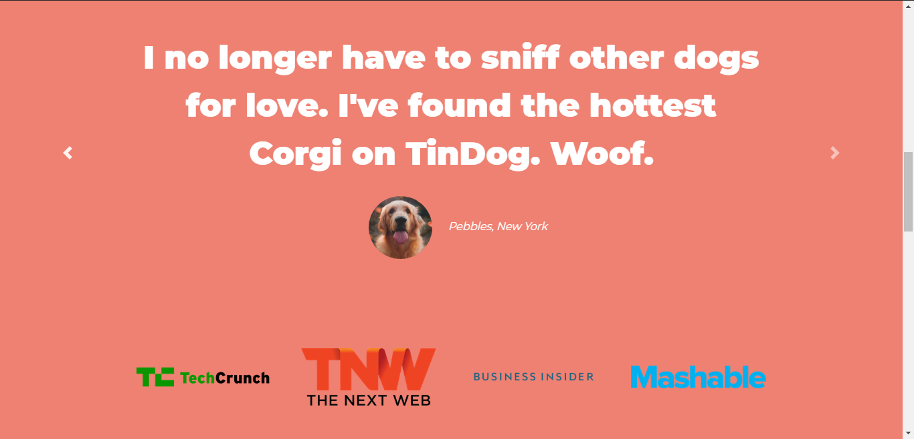
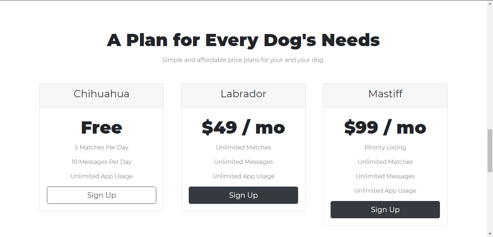
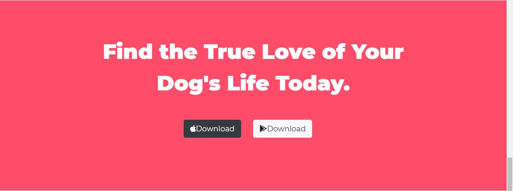

# WebSites
Repositório dedicado a todos os websites desenvolvidos em cursos de front-end.

# TinDog
-WebSite desenvolvido utilizando: **HTML, CSS, Bootstrap 4.6**

-Desenvolvido seguindo orientações do curso [The Complete 2021 Web Development Bootcamp](https://www.udemy.com/course/the-complete-web-development-bootcamp/) de Angela Yu, disponível na Udemy.

